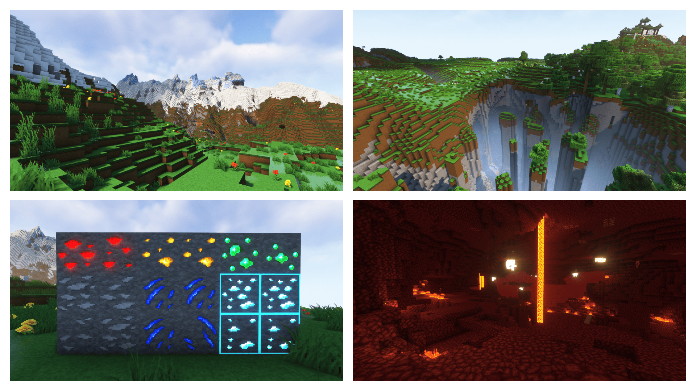
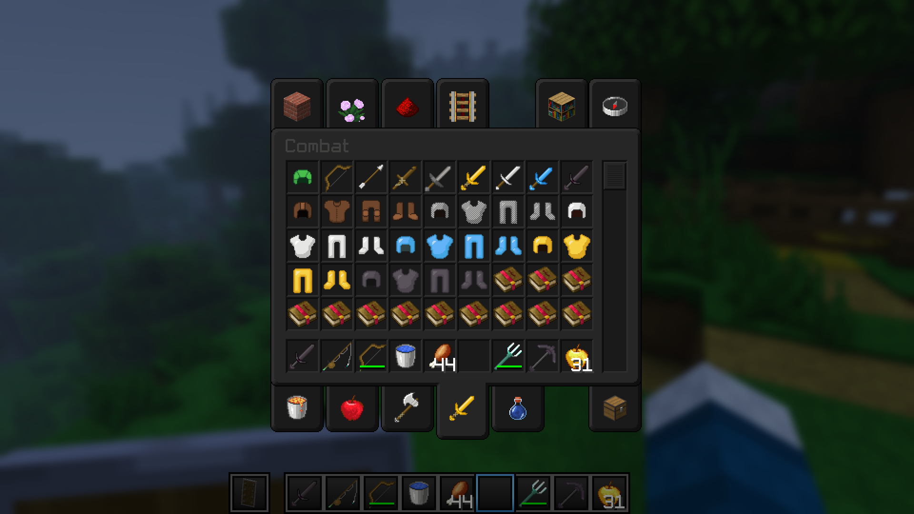

<head>
  <link rel="stylesheet" href="../assets/css/style2.css?v=">
</head>
<header class="page-header" role="banner">
      <h1 class="project-name">{{ page.title | default: "CotCotPack" | default: "CotCotPack" }}</h1>
      <h2 class="project-tagline">{{ page.description | default: site.description | default: site.github.project_tagline }}</h2>
      
        <a href="{{ site.github.repository_url }}" class="btn">View on GitHub</a>
      
      
        <a href="{{ site.github.zip_url }}" class="btn">Download .zip</a>
        <a href="{{ site.github.tar_url }}" class="btn">Download .tar.gz</a>
      
</header>
    

  

    

  
  

# CotCotPack

**CotCot** is a PVP / Build / Survival resource pack for Minecraft Java and Bedrock. The resource pack is updated to the latest version of Minecraft, but also 1.8.x for PVP players. CotCot is a Faithful edit with animated items, 3D models, alternative textures and custom colormap/lightmap. It is also PVP-friendly with Low Fire, Clean Water or small swords. Textures are compressed and optimized for toasters.

## I highly recommend :

[OptiFine](https://www.optifine.net/home)

**OR**
* [Sodium](https://www.curseforge.com/minecraft/mc-mods/sodium)
* [Phosphor](https://www.curseforge.com/minecraft/mc-mods/phosphor)
* [Lithium](https://www.curseforge.com/minecraft/mc-mods/lithium)
* [Indium](https://www.curseforge.com/minecraft/mc-mods/indium/files)
* [Continuity](https://www.curseforge.com/minecraft/mc-mods/continuity/files)
* [Colormatic](https://www.curseforge.com/minecraft/mc-mods/colormatic)
* [Iris](https://www.curseforge.com/minecraft/mc-mods/irisshaders)

**AND**
[Complementary Shaders](https://www.curseforge.com/minecraft/customization/complementary-shaders)

## Some textures made by :

* [Faithful by FaithfulTeam](https://faithful.team)
* [SamaFaithful by Aurelien_Sama](https://www.youtube.com/channel/UCM2e9ub5nKQIvYbIPxSTbOg)
* [Dark UI 32x by that_jogurciQ](https://www.curseforge.com/minecraft/texture-packs/dark-ui-32x)

It is not to be distributed and all assets within said
resource pack are under the copyright of PouletEnSlip.

Made by **PouletEnSlip** © 2022 - All Rights Reserved

