
CotCot is a PVP / Build / Survival resource pack for Minecraft Java. The resource pack is compatible from 1.7.2 to 1.8.9 and from 1.13 to 1.19.x. CotCot is a Faithful edit with animated items, 3D models, alternative textures and custom colormap/lightmap and more. Fully compatible with OptiFine and Sodium. It is also PVP-friendly with Low Fire, Clean Water or small swords. Textures are compressed and optimized for toasters.

  
1 / 12

  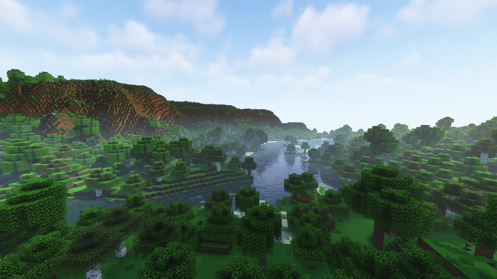

  

  
2 / 12

  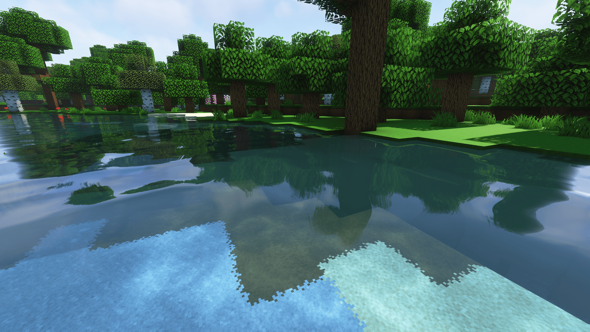

  
3 / 12

  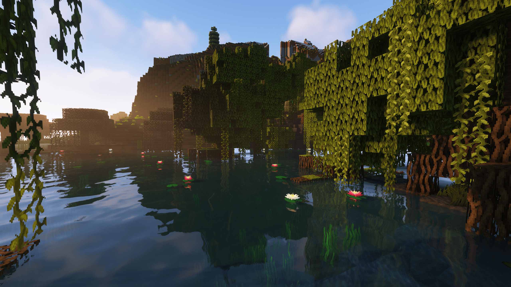

  
4 / 12

  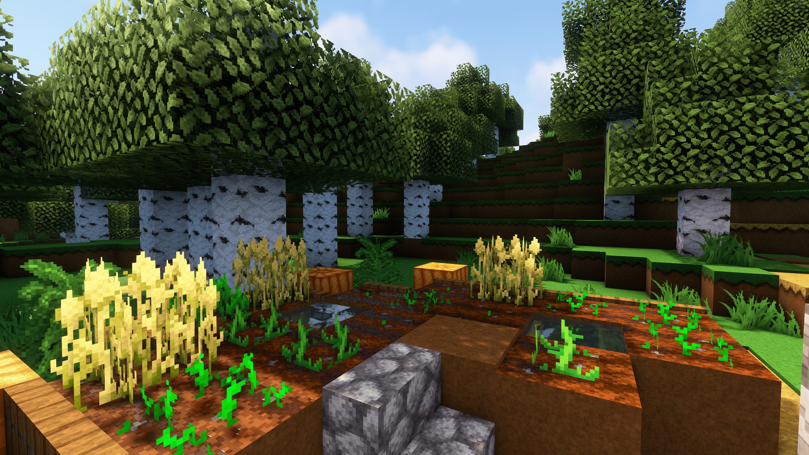

  
5 / 12

  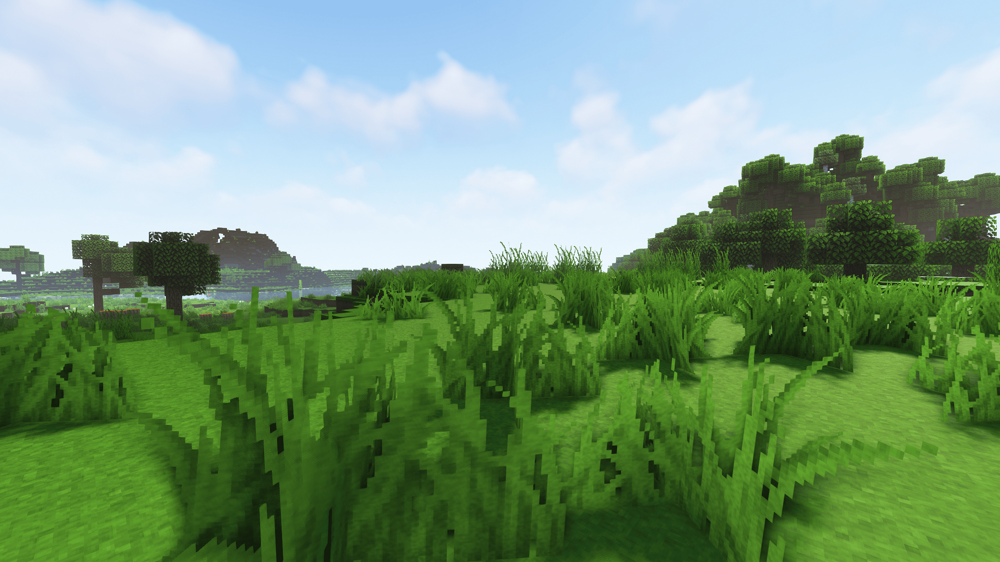

  
6 / 12

  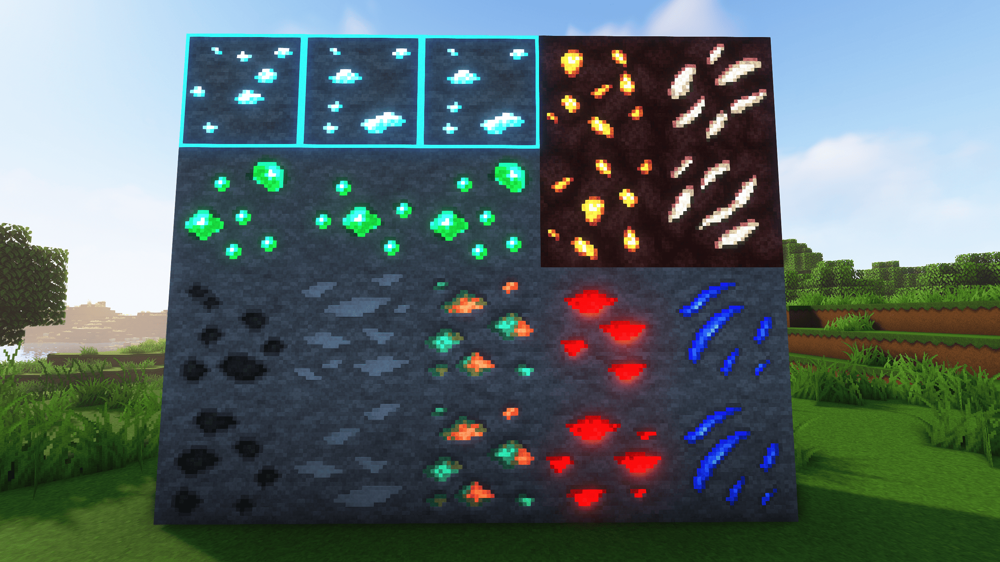

  
7 / 12

  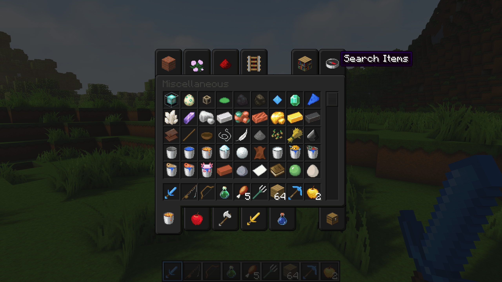

  
8 / 12

  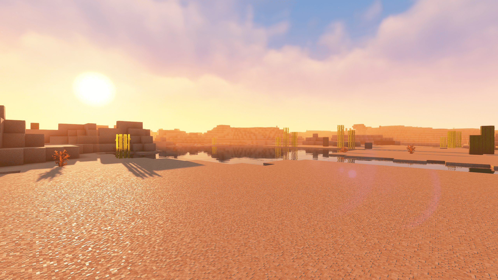

  
9 / 12

  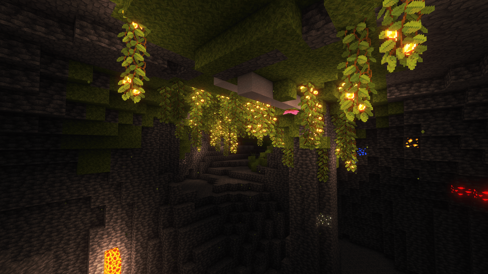

  
10 / 12

  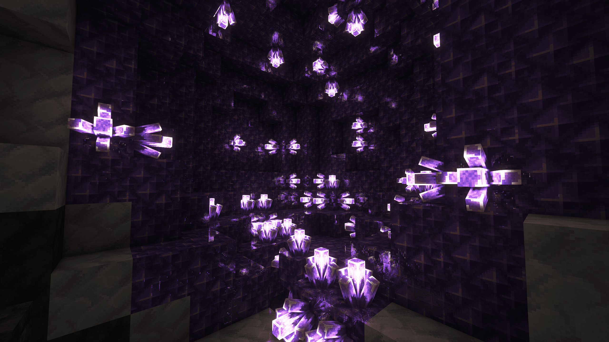

  
11 / 12

  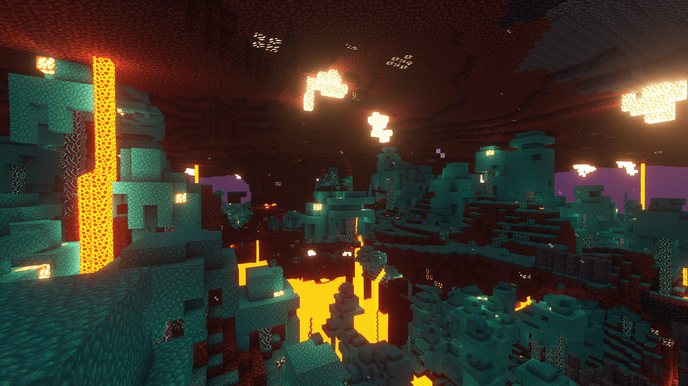

  
12 / 12

  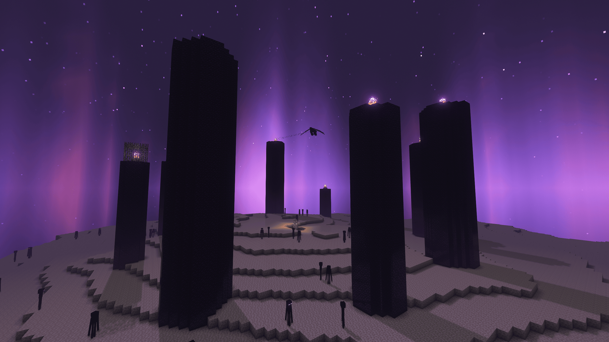

<a class="prev" onclick="plusSlides(-1)">❮</a>
<a class="next" onclick="plusSlides(1)">❯</a>

  
  
  
  
  
  
  
  
  
  
  
  

## I highly recommend

[OptiFine](https://www.optifine.net/home)

**OR**
* [Sodium](https://www.curseforge.com/minecraft/mc-mods/sodium)
* [Phosphor](https://www.curseforge.com/minecraft/mc-mods/phosphor)
* [Lithium](https://www.curseforge.com/minecraft/mc-mods/lithium)
* [Indium](https://www.curseforge.com/minecraft/mc-mods/indium)
* [Continuity](https://www.curseforge.com/minecraft/mc-mods/continuity)
* [Iris](https://www.curseforge.com/minecraft/mc-mods/irisshaders)

**AND**
[Complementary Shaders](https://www.curseforge.com/minecraft/customization/complementary-shaders)

## Features
* Animated items
* 3D models
* Alternative textures
* Connected textures
* Emissive textures
* Custom colormap
* Custom lightmap
* Custom sounds
* Custom GUI
* Custom sky
* Support CTM, CEM and CIT textures
* Support realms textures

## Some textures made by

[Faithful by FaithfulTeam](https://faithful.team) | 
[SamaFaithful by Aurelien_Sama](https://www.youtube.com/channel/UCM2e9ub5nKQIvYbIPxSTbOg) | 
[Dark UI 32x by that_jogurciQ](https://www.curseforge.com/minecraft/texture-packs/dark-ui-32x)

*Last update : 14 June 2022*
