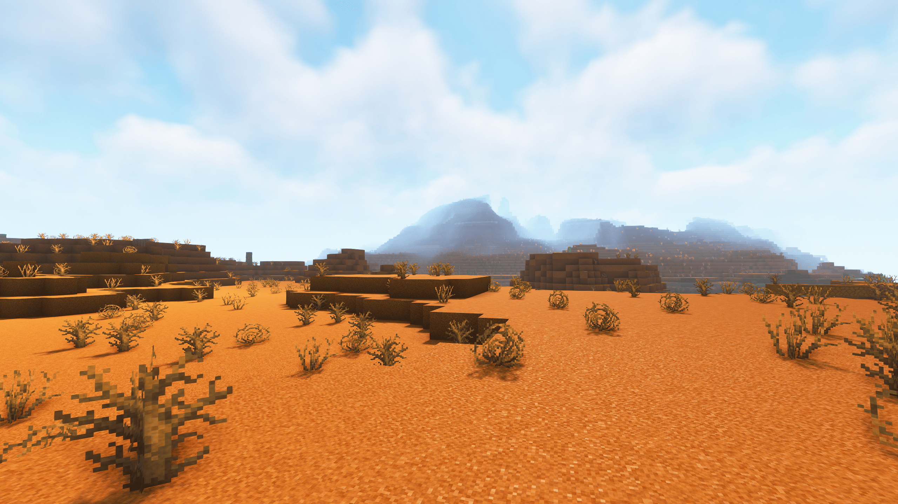

<p style="text-align:justify;"><b>CotCot</b> is a PVP / Build / Survival resource pack for Minecraft Java. The resource pack is compatible from 1.7.2 to 1.8.9 and from 1.13 to 1.19.x. CotCot is a Faithful edit with animated items, 3D models, alternative textures and custom colormap/lightmap and more. Fully compatible with OptiFine and Sodium. It is also PVP-friendly with Low Fire, Clean Water or small swords. Textures are compressed and optimized for toasters.</p>

<div class="slideshow-container">
<div class="mySlides fade">
  <div class="numbertext">1 / 12</div>
  
</div>
  <div class="mySlides fade">
  <div class="numbertext">2 / 12</div>
  
</div>
<div class="mySlides fade">
  <div class="numbertext">3 / 12</div>
  
</div>
<div class="mySlides fade">
  <div class="numbertext">4 / 12</div>
  
</div>
<div class="mySlides fade">
  <div class="numbertext">5 / 12</div>
  
</div>
<div class="mySlides fade">
  <div class="numbertext">6 / 12</div>
  
</div>
<div class="mySlides fade">
  <div class="numbertext">7 / 12</div>
  
</div>
<div class="mySlides fade">
  <div class="numbertext">8 / 12</div>
  
</div>
<div class="mySlides fade">
  <div class="numbertext">9 / 12</div>
  
</div>
<div class="mySlides fade">
  <div class="numbertext">10 / 12</div>
  
</div>
<div class="mySlides fade">
  <div class="numbertext">11 / 12</div>
  
</div>
<div class="mySlides fade">
  <div class="numbertext">12 / 12</div>
  
</div>
<a class="prev" onclick="plusSlides(-1)">❮</a>
<a class="next" onclick="plusSlides(1)">❯</a>
</div>
<div style="text-align:center">
  <span class="dot" onclick="currentSlide(1)"></span>
  <span class="dot" onclick="currentSlide(2)"></span>
  <span class="dot" onclick="currentSlide(3)"></span>
  <span class="dot" onclick="currentSlide(4)"></span>
  <span class="dot" onclick="currentSlide(5)"></span>
  <span class="dot" onclick="currentSlide(6)"></span>
  <span class="dot" onclick="currentSlide(7)"></span>
  <span class="dot" onclick="currentSlide(8)"></span>
  <span class="dot" onclick="currentSlide(9)"></span>
  <span class="dot" onclick="currentSlide(10)"></span>
  <span class="dot" onclick="currentSlide(11)"></span>
  <span class="dot" onclick="currentSlide(12)"></span>
</div>

## How to install:

Drag the ZIP file in ```C:\Users\AppData\Roaming\.minecraft\resourcepacks\```

To make the resource pack work, you need [OptiFine](https://www.optifine.net/home), but I highly recommend these Fabric mods for best performance:

* [Sodium](https://www.curseforge.com/minecraft/mc-mods/sodium), [Phosphor](https://www.curseforge.com/minecraft/mc-mods/phosphor) and [Lithium](https://www.curseforge.com/minecraft/mc-mods/lithium), for performance
* [Indium](https://www.curseforge.com/minecraft/mc-mods/indium), to make Continuity work with Sodium
* [Continuity](https://www.curseforge.com/minecraft/mc-mods/continuity), for alternative textures (blocks)
* [CIT Resewn](https://www.curseforge.com/minecraft/mc-mods/cit-resewn), for alternative textures (items)
* [Iris](https://www.curseforge.com/minecraft/mc-mods/irisshaders), for shaders
* [Complementary Shaders](https://www.curseforge.com/minecraft/customization/complementary-shaders), the shader pack I use

## Features:
* Animated items
* 3D models
* Alternative textures
* Connected textures
* Emissive textures
* Custom colormap
* Custom lightmap
* Custom sounds
* Custom GUI
* Custom sky
* Support CTM and CIT textures
* Support realms textures

## Some textures made by:

[Faithful by FaithfulTeam](https://faithful.team) | 
[SamaFaithful by Aurelien_Sama](https://www.youtube.com/channel/UCM2e9ub5nKQIvYbIPxSTbOg) | 
[Dark UI 32x by that_jogurciQ](https://www.curseforge.com/minecraft/texture-packs/dark-ui-32x)

#### See my pack on [Github](https://github.com/PouletEnSlip/CotCotPack) and [CurseForge](https://www.curseforge.com/minecraft/texture-packs/cotcotpack/)

*Last update : 10 July 2022*
